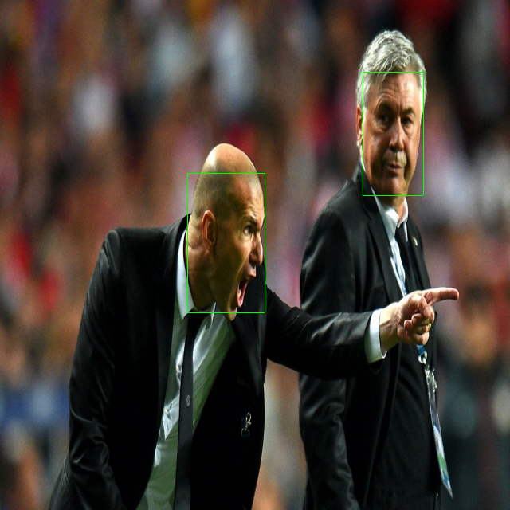

# zig-rknn

This project demonstrates how to run an **RKNN model on the RK3588 NPU** using **Zig**, including loading an RKNN model, running inference, and writing the output image using [zigimg](https://github.com/zigimg/zigimg).

The example in `src/main.zig` takes input image of size **640×640**. This avoids resizing code and keeps the example focused on NPU inference.

`/src/rknn_api.zig` RKNN C-API bindings generated with `zig translate-c`.

## Requirements
- Language versin **Zig 0.15.1**.
- [zigimg](https://github.com/zigimg/zigimg) for reading and writing images.
- [rknn-toolkit2](https://github.com/airockchip/rknn-toolkit2.git) see [Axon-NPU-Guide](https://github.com/vicharak-in/Axon-NPU-Guide) for how to install `rknn-toolkit2`.

## Building
```bash
zig build run
```

## Results


